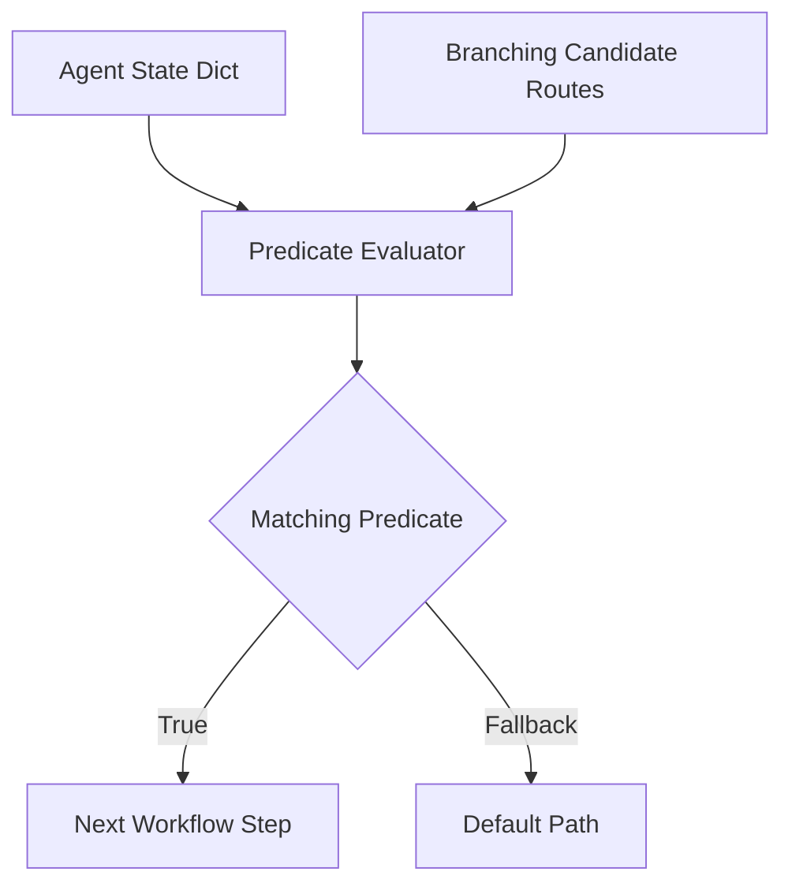

# genpark-conditional-branch-router-state-evaluator-skill

Dynamic condition routing engine evaluating boolean expressions against active agent state records.

## Architecture

## Features
- **Sandbox Evaluation**: Zero access to built-in system functions.
- **Fallback Handling**: Graceful fallback to default routes.
